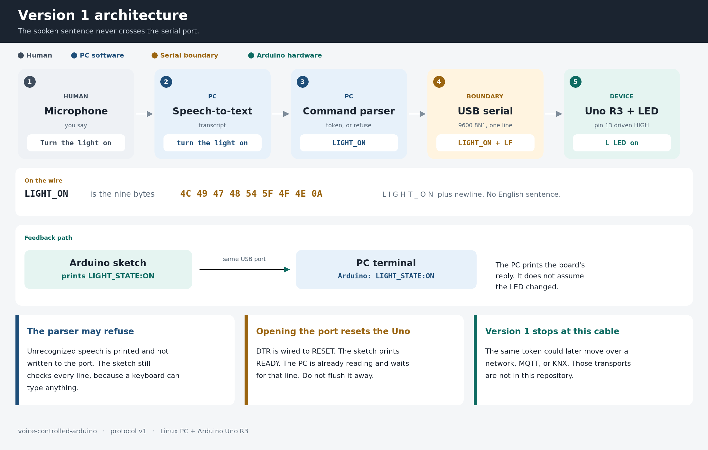
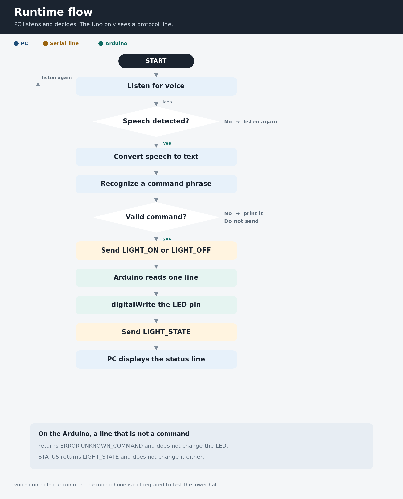
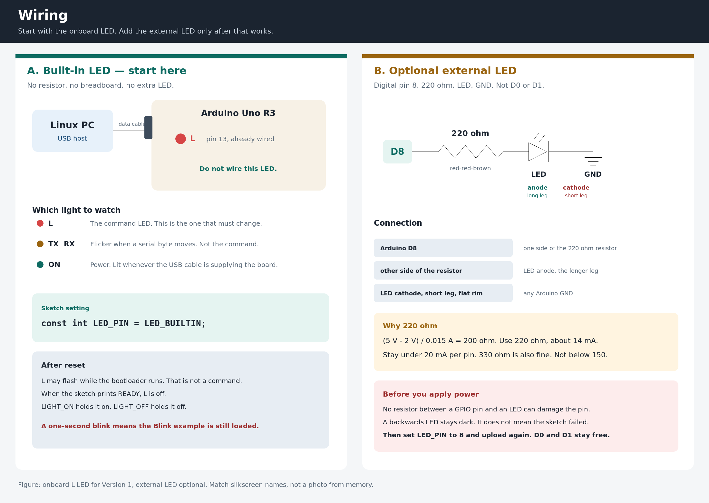

# 🎤 Voice-Controlled Arduino LED

### Version 1 — Voice → Serial → Arduino → LED

A beginner-friendly project that connects **voice recognition to real hardware** using Python, USB serial communication, and an Arduino Uno.

The idea is simple:

```text
🎤 Human Voice
      ↓
💻 Python
      ↓
🧠 Speech Recognition
      ↓
🔎 Command Parser
      ↓
🔌 USB Serial
      ↓
🤖 Arduino Uno
      ↓
📍 Digital Pin 8
      ↓
💡 LED
```

The PC handles the voice.

The Arduino handles the hardware.

The communication between them uses a simple and explicit serial protocol.

---

## ✨ What This Project Does

You say:

> "Turn the light on"

The PC converts the sentence into:

```text
LIGHT_ON
```

Then sends it to the Arduino through USB serial.

The Arduino turns on the external LED connected to **digital pin 8** and sends a status response back:

```text
LIGHT_STATE:ON
```

The complete flow is:

```text
🎤 Voice
   ↓
🧠 Speech-to-Text
   ↓
🔎 Command Parser
   ↓
"LIGHT_ON"
   ↓
🔌 USB Serial
   ↓
🤖 Arduino Uno
   ↓
💡 External LED
   ↓
↩️ Status Response
   ↓
💻 Python
```

---

## 🧠 Project Concept

This project is **Version 1** of a larger progression from basic Arduino programming to IoT and Building Automation.

The objective is to understand the fundamentals first:

```text
Human
  ↓
Voice
  ↓
Software
  ↓
Command
  ↓
Communication
  ↓
Microcontroller
  ↓
Physical Output
```

The Arduino does **not** understand natural language.

It only receives predefined commands such as:

```text
LIGHT_ON
LIGHT_OFF
STATUS
```

This separation keeps the hardware simple and makes the system easier to extend later.

---

## 🏗️ System Architecture



The project is divided into two main sides.

### 💻 PC Side

The PC is responsible for:

* 🎤 Capturing voice from the microphone
* 🧠 Converting speech into text
* 🔎 Parsing the recognized sentence
* 🔌 Sending commands through USB serial
* ↩️ Reading the Arduino response

### 🤖 Arduino Side

The Arduino is responsible for:

* 📥 Receiving commands
* 🔎 Validating commands
* 💡 Controlling the LED
* 📤 Sending the current state back to the PC

The two sides communicate using a small serial protocol instead of sending natural-language sentences directly to the Arduino.

---

## 🔄 Project Flow



The main sequence is:

```text
🎤 Speak
  ↓
🧠 Speech Recognition
  ↓
🔎 Command Parsing
  ↓
📨 Generate Command
  ↓
🔌 Send through USB
  ↓
🤖 Arduino receives command
  ↓
💡 Control LED
  ↓
📤 Send status
  ↓
💻 Display result
```

---

## 🔌 Hardware

### Required Components

| Component         | Purpose                      |
| ----------------- | ---------------------------- |
| 🤖 Arduino Uno R3 | Microcontroller              |
| 💡 LED            | Physical output              |
| 🧱 220 Ω resistor | Current limiting             |
| 🔗 Jumper wires   | Connections                  |
| 🟫 Breadboard     | Optional                     |
| 🔌 USB cable      | Power + serial communication |
| 🎤 Microphone     | Voice input                  |

No relay or mains voltage is used in this project.

The output is a low-voltage LED.

---

## 🔧 Wiring

The current implementation uses an **external LED connected to digital pin 8**.



The basic connection is:

```text
Arduino D8
    │
    ↓
  220 Ω
    │
    ↓
LED Anode (+)
LED Cathode (-)
    │
    ↓
   GND
```

### Connections

```text
D8 ─── 220 Ω resistor ─── LED long leg (+)

LED short leg (-) ─────── GND
```

The resistor must be connected in series with the LED.

The Arduino sketch uses:

```cpp
const int LED_PIN = 8;
```

---

## 💻 Software

### Requirements

* 🐧 Linux
* 🐍 Python 3.10+
* 🤖 Arduino Uno R3
* 🎤 Microphone
* 🔌 USB connection
* 🌐 Internet connection for Google Web Speech

Python libraries used by the project:

```text
pyserial
SpeechRecognition
```

PyAudio is optional.

When PyAudio is unavailable, the voice controller can use `arecord` as a microphone fallback.

---

## 📦 Installation

### Arch Linux

Install the required system packages:

```bash
sudo pacman -S python python-pip alsa-utils
```

Create a virtual environment:

```bash
python3 -m venv .venv
source .venv/bin/activate
```

Install the Python dependencies:

```bash
python -m pip install --upgrade pip
python -m pip install pyserial SpeechRecognition
```

### Debian / Ubuntu

Install the required packages:

```bash
sudo apt update
sudo apt install -y python3 python3-pip python3-venv alsa-utils
```

Create the virtual environment:

```bash
python3 -m venv .venv
source .venv/bin/activate
```

Install the Python dependencies:

```bash
python -m pip install --upgrade pip
python -m pip install pyserial SpeechRecognition
```

---

## 🤖 Arduino Setup

Open:

```text
voice_light_controller.ino
```

Upload the sketch to the Arduino Uno using the Arduino IDE.

The current LED configuration is:

```cpp
const int LED_PIN = 8;
```

After startup, the Arduino sends:

```text
READY
```

This tells the PC that the Arduino is ready to receive commands.

---

## 🧪 Test the Arduino

Before testing voice recognition, test the Arduino and LED independently.

Open the Arduino Serial Monitor.

Use:

```text
Baud Rate: 9600
Line Ending: Newline
```

Send:

```text
LIGHT_ON
```

Expected response:

```text
LIGHT_STATE:ON
```

The external LED connected to D8 should turn on.

Then send:

```text
LIGHT_OFF
```

Expected response:

```text
LIGHT_STATE:OFF
```

The LED should turn off.

You can also send:

```text
STATUS
```

to check the current LED state.

---

## 🐍 Test with Python

After uploading the Arduino sketch, close the Arduino Serial Monitor.

Activate the virtual environment:

```bash
source .venv/bin/activate
```

Test the ON command:

```bash
python3 voice_controller.py --send LIGHT_ON
```

Expected output:

```text
Port: /dev/ttyUSB0
Baud: 9600
Waiting for Arduino READY...
Arduino: READY
Arduino: LIGHT_STATE:ON
```

Test the OFF command:

```bash
python3 voice_controller.py --send LIGHT_OFF
```

The LED should turn off.

This confirms the complete communication path:

```text
🐍 Python
   ↓
🔌 USB Serial
   ↓
🤖 Arduino
   ↓
💡 LED
```

without involving speech recognition.

---

## 🎤 Voice Control

Start the voice controller:

```bash
python3 voice_controller.py
```

When the program displays:

```text
Listening...
```

say:

```text
Turn the light on
```

The system should produce something similar to:

```text
You said: turn the light on
Command: LIGHT_ON
Sending to Arduino...
Arduino: LIGHT_STATE:ON
```

The LED should turn on.

For example:

```text
Turn the light off
```

becomes:

```text
LIGHT_OFF
```

and the Arduino turns the LED off.

---

## 🔎 Command Parser

The command parser converts natural-language input into predefined hardware commands.

Example:

```text
"turn the light on"
          ↓
      LIGHT_ON
```

Another example:

```text
"turn the light off"
          ↓
      LIGHT_OFF
```

Unknown or unrelated sentences should not be sent directly to the Arduino.

The parser can be tested independently:

```bash
python3 test_parser.py
```

This makes it possible to test the software logic before connecting the hardware.

---

## 🔄 Serial Protocol

The communication protocol is intentionally simple.

### PC → Arduino

```text
LIGHT_ON
LIGHT_OFF
STATUS
```

### Arduino → PC

```text
READY
LIGHT_STATE:ON
LIGHT_STATE:OFF
ERROR:UNKNOWN_COMMAND
ERROR:LINE_TOO_LONG
```

Example:

```text
PC → Arduino
LIGHT_ON

Arduino → PC
LIGHT_STATE:ON
```

The PC handles natural language.

The Arduino handles deterministic commands.

---

## 🎙️ Microphone Test

The project can use `arecord` when PyAudio is not available.

Check available recording devices:

```bash
arecord -l
```

Record a short sample:

```bash
arecord -d 3 -f S16_LE -r 16000 -c 1 /tmp/mic-test.wav
```

Play the recording:

```bash
aplay /tmp/mic-test.wav
```

If you can hear the recording, the microphone is working correctly at the system level.

---

## ⚠️ Troubleshooting

### `/dev/ttyUSB0 is already open`

Close the Arduino IDE Serial Monitor.

Only one application should use the serial port at a time.

You can check which process is using the port:

```bash
fuser -v /dev/ttyUSB0
```

---

### 💡 LED does not turn on

Check the wiring:

```text
D8
 ↓
220 Ω
 ↓
LED (+)
LED (-)
 ↓
GND
```

Also verify that the Arduino sketch contains:

```cpp
const int LED_PIN = 8;
```

---

### 🔌 Arduino is not detected

Check available serial devices:

```bash
ls -l /dev/ttyUSB* /dev/ttyACM*
```

Depending on the USB-to-serial chip, the Arduino may appear as:

```text
/dev/ttyUSB0
```

or:

```text
/dev/ttyACM0
```

---

### 🎤 Microphone is not detected

Run:

```bash
arecord -l
```

If `arecord` is not installed on Arch Linux:

```bash
sudo pacman -S alsa-utils
```

---

### 🌐 Speech recognition is not working

The default Google Web Speech recognition requires an internet connection.

First verify that:

* Your microphone is detected.
* The microphone can record audio.
* Internet access is available.
* The Arduino serial port is not being used by another application.

---

## 📁 Project Structure

The repository intentionally keeps Version 1 simple:

```text
voice-controlled-arduino/
│
├── 📄 README.md
│
├── 🖼️ architecture.png
├── 🖼️ flowchart.png
├── 🖼️ wiring.png
│
├── 🐍 command_parser.py
├── 🧪 test_parser.py
├── 🎤 voice_controller.py
│
└── 🤖 voice_light_controller.ino
```

Everything required for this Version 1 implementation is contained in the repository root.

---

## 🗺️ Roadmap

This project is the first step in a larger progression.

### V1 — Fundamentals

```text
🎤 Voice
 ↓
💻 PC
 ↓
🔌 USB Serial
 ↓
🤖 Arduino
 ↓
💡 LED
```

### V2 — Multiple Outputs

```text
🎤 Voice
 ↓
🔌 Serial
 ↓
🤖 Arduino
 ↓
💡 💡 💡 Multiple Outputs
```

### V3 — Wi-Fi

```text
🎤 Voice
 ↓
📡 Wi-Fi
 ↓
ESP32
 ↓
💡 Device
```

### V4 — MQTT

```text
🎤 Voice
 ↓
📬 MQTT
 ↓
ESP32
 ↓
💡 Device
```

### V5 — Node-RED

```text
🎤 Voice
 ↓
🔀 Node-RED
 ↓
📬 MQTT
 ↓
ESP32
 ↓
💡 Device
```

### V6 — Building Automation

```text
🎤 Voice
 ↓
🔀 Node-RED
 ↓
⚡ KNX
 ↓
🔌 Actuator
 ↓
💡 Real Light
```

The objective is to introduce one new layer at a time while keeping the previous concepts understandable and reusable.

---

## 🚀 Future Direction

Future versions will progressively introduce:

* 📡 Wi-Fi
* 📬 MQTT
* 🔀 Node-RED
* 🏠 Home Automation
* ⚡ KNX
* 🔄 Device feedback
* 🧠 Local AI
* 🏢 Building Automation

The long-term direction is to move from a simple Arduino experiment toward real **IoT and Building Automation architectures**.

---

## 📺 Project Series

This project is part of a practical progression:

### **From Arduino to Building Automation**

Starting from:

```text
Arduino → Serial → LED
```

and progressively moving toward:

```text
IoT → MQTT → Node-RED → KNX → Building Automation
```

Each version adds a new technical layer instead of replacing everything from the previous version.

---

## 👤 Author

**Abdelkhalek Mammeri**

Electronics • IoT • Building Automation • IT/OT

GitHub: **Ab40D**

